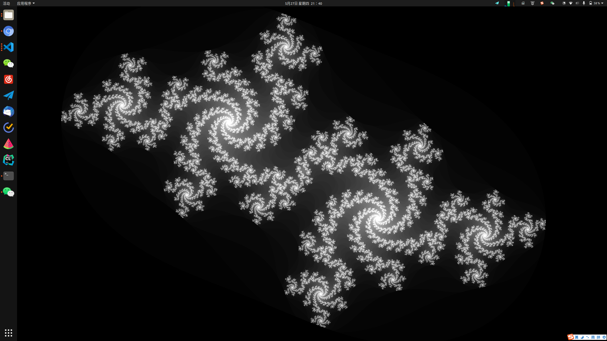
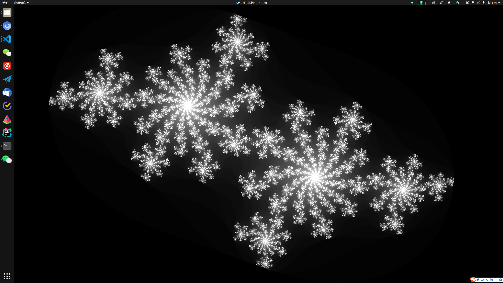

# xjuliabg

julia set dynamic wallpaper of ubuntu





## install

```bash
mkdir build
cmake ..
make
make install
```

## usage
```
usage: 
  juliabg -f fps -v speed -k time_kernel -r
params:
  -f fps    a float, the refresh rate of the program, default 22.38 (which is equal to 55.95 / 2.5)
  -v speed  a float, the speed of rotating, default is 0.01
  -k kernel a float, the closer to zero, the faster not-so-beautiful frame runs over. default is 0.7
  -p phase    a float in [0, 1], represent the phase. default 0.4
  -u profile  use a profile, [slow, medium, fast]
  -r        reverse the rotating
  -h        show help
```

In my laptop, the command `juliabg -u slow` consumes 1W powers only! 

If you want to run it in background, run `nohup juliabg -u slow &`.

## How this works

I change the source code of glfw `src/x11_init.c`, line 550:

```c++
_glfw.x11.NET_WM_WINDOW_TYPE_NORMAL =
    // getAtomIfSupported(supportedAtoms, atomCount, "_NET_WM_WINDOW_TYPE_NORMAL");
    getAtomIfSupported(supportedAtoms, atomCount, "_NET_WM_WINDOW_TYPE_DESKTOP");
```

then the window created by glfw will show in desktop.
